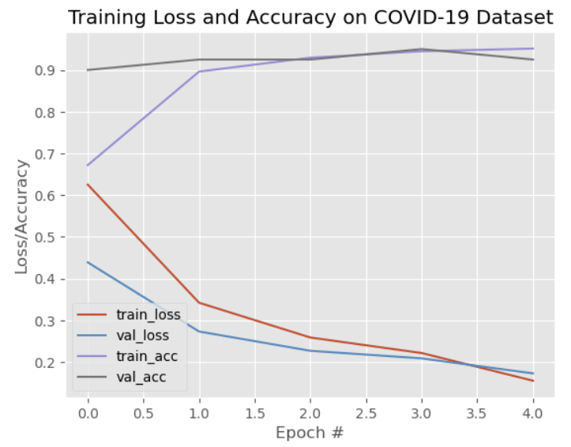
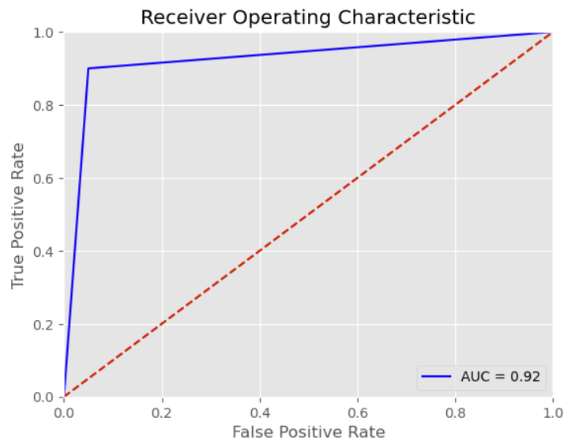

## COVID-19 X-ray Classification: Project Overview
* Created a tool that classifies whether or not an individual may have COVID based on their posteroanterior (PA) chest view. 
* Model accuracy on the test set ranges from 90 - 95%. 
* Built a client facing API using flask which will be deployed for the use of hospitals in the Philippines.

## Code and Resources Used

**Python Version**: 3.8

**Packages**: pandas, numpy, sklearn, matplotlib, seaborn, tensorflow (keras), flask, imutils, open_cv

**For Web Framework Requirements**: pip install -r requirements.txt

**Dataset**: PA chest photos for training will be supplied by the Providence Hospital in Quezon City, Philippines.

**Consolidated Articles**: 
* https://www.pyimagesearch.com/2020/03/16/detecting-covid-19-in-x-ray-images-with-keras-tensorflow-and-deep-learning/
* https://towardsdatascience.com/building-a-web-application-to-deploy-machine-learning-models-e224269c1331

## Model Performance
The convolutional neural network model we will be using is the transfer learning application **VGG16**. It may be a good idea to contrast its performance with other transfer learning approaches such as ResNet50 and NASNetLarge. I will test this is in the future.

The Current Model's accuracy on the test set ranges from 90 - 95% whilst its accuracy on the Providence Hospital's patients have been 73% thus far. 

Here are the ROC/AUC Curves of our VGG16 model:

  

## Deployment/Productionization
The webapp is currently being hosted here: http://206.189.82.204/
